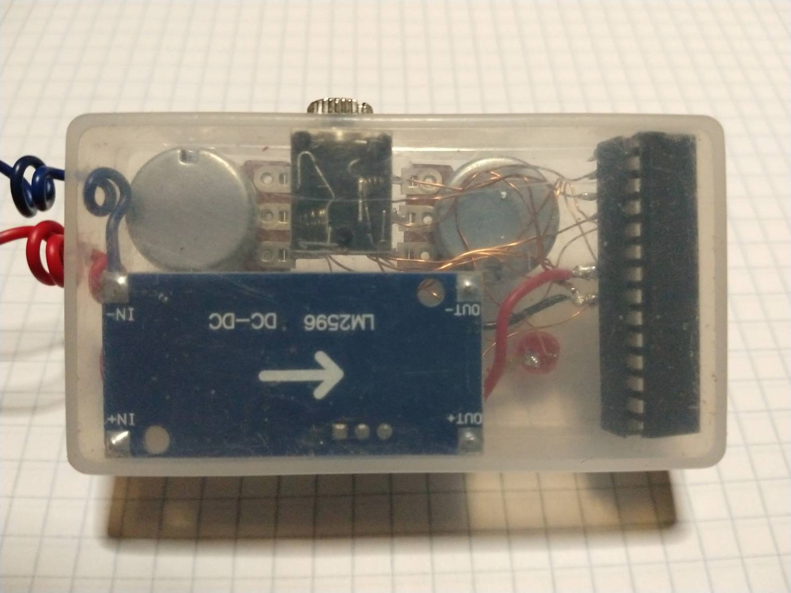

CatIVity - CAT protocol (Icom CI-V) based remote VFO tuner

## Background

I recently got my amateur radio license and bought a Xiegu G90 as my first transceiver
to have something to play around with. The radio is well regarded in the ham community
and indeed does a pretty decent job for its price. That is, until it comes to tuning.

Like many other simple QRP transceivers, it has just a rudimentary VFO tuner that uses
a cheap mechanical rotary encoder with an even cheaper plastic knob mounted on it.

Such encoders tend to give up life really soon when heavily used. Additionally it is
next to impossible to efficiently tune up and down the bands. The aforementioned plastic knob
doesn't lend itself to quick operation and either you risk cramps in your fingers
or annoying delays/interruptions when changing the frequency decimal position that is
updated when you turn the knob.

As tuning around the bands looking for interesting stations to make contact with is
the main activity (at least speaking for myself) when "playing radio" that tuning behavior
of the G90 is plainly unacceptable.

Xiegu addresses that issue by selling a companion device (GSOC Touch Screen Controller)
that has a larger screen and decent knobs but that:

```
a.) Doubles the price of the setup (at which point you could look into buying an Icom 7300)
b.) Needs to be carried around as well if you are operating mostly portable, like myself.
```

As I was willing to accept neither a.) nor b.) I looked for an alternative and came up
with the solution implemented in this project.

## Solution

The G90 can be controlled via UART using a CAT protocol (more precisely: an Icom CI-V flavor)
so it is easy to implement something on a microcontroller that has a UART on it (alternatively
you can implement a "bit banged" software-UART if it doesn't) and that somehow determines the
frequency to be set, then instructs the G90 to tune to the determined frequency.

I chose to use two potentiometers (potentiometers are dirt cheap and can easily be replaced
when worn out) as the tuning knobs and to control with them the lower 5 decimal position of the
frequency.  More precisely the upper 4 of the lower 5 as the last decimal position is always 0 -
the minimum tuning step for the G90 is 10 Hz.
As the multifunction knob on the G90 can be configured to set the 6th decimal point (100k frequency
step) and there are buttons to change the bands, tuning becomes quite fluent.
The only awkward thing about that decision is that a potentiometer needs to be "reset" manually by
turning it back to its initial position. Alternatively you can tune one time upwards to 99 then
downwards to 0, which makes no difference to the frequency range scanned.

The implementation is pretty straight forward:

First synchronize with the G90 to get the current frequency it is tuned to. That frequency can
change anytime due to user intervention so it needs to be fetched every time before sending
a "SetActiveVFOFrequency" command. The CI-V command to get the frequency is "GetActiveVFOFrequency".

Once the current frequency is known, read the value of the ADC channels to which the two potentiometers
are attached (let's call them (L)eft and (R)ight). The potentiometers form a voltage divider and the
value read by the ADC reflects their relative position to zero volt. When the potentiometer is completely
"down" the ADC reads 0, conversely it will read the maximum value 1024 (the ADC works with 10 bits)
when the pot is completely "up". Dividing the ADC value by 10 brings it into range for what is needed
(0..99) and as a nice side effect also acts as a debouncing mechanism.

The next step is to construct the "SetActiveVFOFrequency" message with the read and translated ADC values
and send it to the radio then wait for the response of the radio. Then "rinse and repeat".

Example:

Lets say the current frequency set on the radio is 14198760 Hz. The ADC value 23 for the Left pot
and 45 for the right pot were read. Next the value 98 in the current frequency is substituted for 23
and 76 for 45 resulting in the frequency-to-be set 14123450 Hz.

```
 14 198 760 <- Currently frequency on the radio
     || ||
     23 45  <- Left and Right pot values read form ADC
     || ||
 14 123 450 <-  Final frequency that will be requested via "SetActiveVFOFrequency"
```

This frequency is translated into the specific protocol message byte sequence (look into the protocol
specification (links in the references section below) for how the data is encoded) and sent to the G90.


The implementation was done on a spare ATmega328P which has a hardware UART and ADC on it.
It is less than 300 lines of code (including comments and blanks).

While this toy is Xiegu G90 specific it should be really easy to port it to any other radio
that supports the CI-V protocol.

73! Helmut, YO6ASM

## Hardware


```
1 x Atmel (Microchip) ATmega328P microcontroller - PDIP package
1 x red LED
2 x 10K potentiometer
1 x 100n capacitor
2 x 10K resistor
1 x 200ohm resistor
1 x Stereo audio jack
2 x Stereo audio plug (to make the cable to connect to the G90)

2 x Platic knob (recycled original G90 knobs)
1 x Platic housing (in this example: an old bicycle tire repair kit)
```

## Software


## TODO

```
In a next iteration replace the potentiometers with a single optical rotary encoder and a
large tuning knob.
Add an LCD display for displaying the frequency and other status information.
Add a few buttons and make their function configurable via a dedicated PC application.
Larger housing to accommodate the additional space needed by the above additions.
```

## Pictures





## Development environment

Developed under GNU/Linux - [Debian](https://www.debian.org/) (Desktop) and [Raspbian](https://www.raspberrypi.org/downloads/raspbian/) (Raspberry Pi)
distributions

Toolchain and other tools/utilities used:

Desktop

- avr-gcc

Raspberry Pi

- avr-gcc
- avrdude

The provided Makefile is meant to be used on a Raspberry Pi.
Note that the reset pin of the ATmega328P is connected to pin 21 of the Raspberry
and is pulled low before starting to flash the binary to the microcontroller.

## References

- Icom's CI-V protocol specification [Computer Interface, version V](https://www.icomeurope.com/wp-content/uploads/2020/08/IC-705_ENG_CI-V_1_20200721.pdf)
- Xiegu G90 CAT protocol specification [Xiegu G90, CAT and digital modes](https://radioddity.s3.amazonaws.com/Radioddity%20-%20Xiegu%20G90%2C%20CAT%20and%20Digital%20modes%20V1.0_20210623.pdf)

## Homepage And Source Code Repository

https://github.com/coronensis/cativity

## Contact

Feel free to reach out if you run into problems building this project or want to extend or port it.

Helmut Sipos, YO6ASM <yo6asm@gmail.com>
