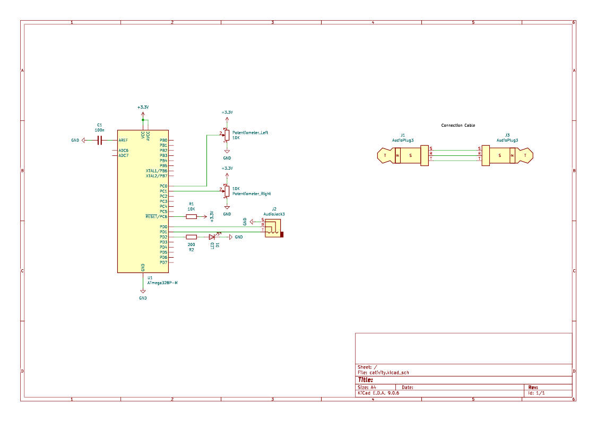
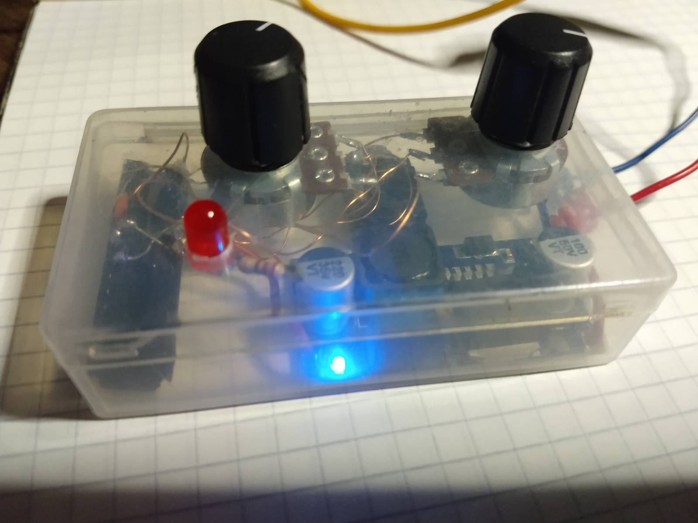
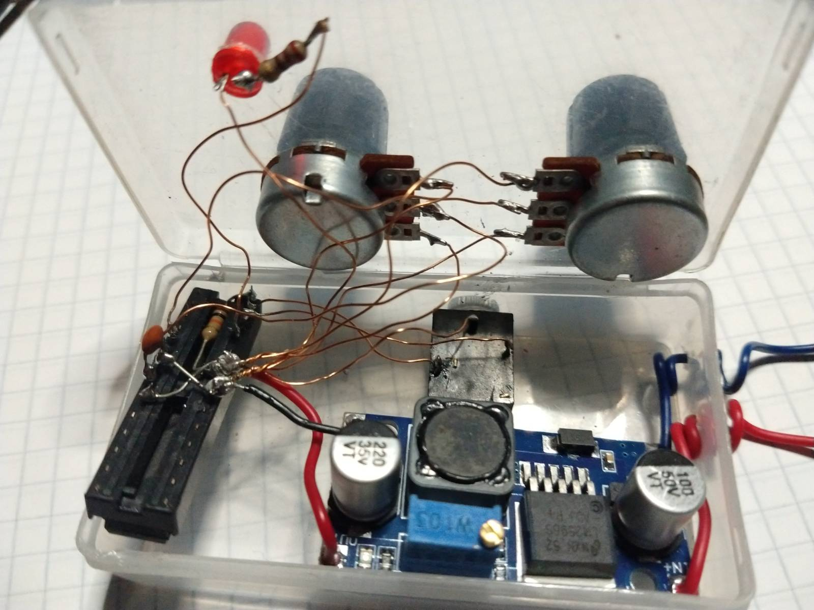
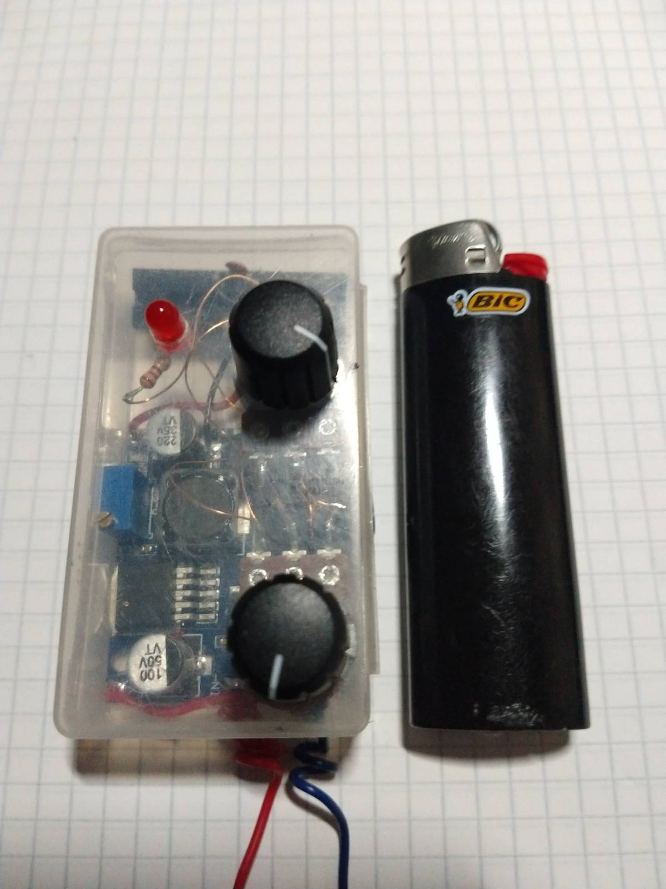

## Overview

CatIVity - CAT protocol (Icom CI-V) based remote VFO tuner

## Motivation

I recently got my amateur radio license and bought a Xiegu G90 as my first transceiver
to have something to play around with. The radio is well regarded in the ham community
and indeed does a pretty decent job for its price. That is, until it comes to tuning.

Like many other simple QRP transceivers, it has just a rudimentary VFO tuner that uses
a cheap mechanical rotary encoder with an even cheaper plastic knob mounted on it.

Such encoders tend to give up life really soon when heavily used. Additionally it is
next to impossible to efficiently tune up and down the bands. The besaid plastic knob
doesn't led itself to quick operation and either you risc cramps in your fingers
or you have to push the knob to change the frequency decimal position that is updated
when you turn the knob.

As tuning around the bands looking for interesting stations to make contacts with is
the main activity (at least speaking for myself) when "playing radio" that tuning behavior
of the G90 is plainly unacceptable.

Xiegu addresses that issue by selling a companion device (GSOC Touch Screen Controller)
that has a larger screen and decent knobs but that:
a.) Doubles the price of the setup (at which point you could look into buying an Icom 7300)
b.) Needs to be carried around as well if you are operating mostly portable, like myself.

As I was willing to accept neither a.) nor b.) I looked for an alternative and came up
with the solution implemented in this project.

## Solution

The G90 can be controlled via UART using a CAT protocol (more precisely, the Icom CI-V flavor)
so it is easy to implement something on a microcontroller that has a UART on it (alternatively
you can implement a "bit banged" software-UART if it doesn't) and that somehow determines the
frequency to be set, then "talks" to the G90 sending it a command to tune to frequency xyz.

The idea was to use two potentiometers as the tuning knobs and to control with them the
lower 5 decimal position of the frequency. More precisely the upper 4 of the lower 5 as the
last decimal position is always 0 - the minimum tuning step for the G90 is 10 Hz.

First we need to synchronize with the G90 to get the curent frequency it is tuned to. That frequency
can change anytime due to user intervention so it needs to be fetched every time before sending a
"SetActiveVFOFrequency" command. The CI-V command to get the frequency is "GetActiveVFOFrequency".

Once we have the frequency we read the value of the ADC channels to which the two potentiometers
are attached (let's call them (L)eft and (R)ight). The potentiometers form a voltage divider and the
value read by the ADC reflects their relative position to zero volt. When the potentiometer is completely
"down" the ADC reads 0, conversely it will read the maximum value 1024 (the ADC works with 10 bits)
when the pot is completely "up". Dividing the ADC value by 10 brings it into range for what we need
(0..99)

The next step is to construct the "SetActiveVFOFrequency" message with the  read and translated ADC
and send it to the radio then wait for the response of the radio. Then "rinse and repeat"

Lets say the current frequency set on the radio was "14.198.760" and we read the ADC values 23 for
the Left pot and 45 for the right pot.

```
 14.198.760 <- Currently frequency on the radio
     || ||
     23 45  <- Left and Right pot values read form ADC
     || ||
 14.123.450 <-  Final frequency that will be requested via "SetActiveVFOFrequency"
```

The implementation was done on a spare ATmega328P which has a hardware UART and ADC on it.
It is less than 300 lines of code (including comments and blanks).

While this toy is Xiegu G90 specific it should be really easy to port it to any other radio
that supports the CI-V protocol.

73! Helmut, YO6ASM


## Hardware



```
1 x Atmel (Microchip) ATmega328P microcontroller - PDIP package
1 x red LED
2 x 10K potentiometer
1 x 100n capacitor
2 x 10K resistor
1 x 200ohm resistor
1 x Stereo audio jack
2 x Stereo audio plug (to make the cable to connect to the G90)

2 x Platic knob (recycled original G90 knobs)
1 x Platic housing (in this example: an old bicycle tire repair kit)
```

## Software


## Pictures







## Development environment

Developed under GNU/Linux - [Debian](https://www.debian.org/) (Desktop) and [Raspbian](https://www.raspberrypi.org/downloads/raspbian/) (Raspberry Pi)
distributions

Toolchain and other tools/utilities used:

Desktop

- avr-gcc

Raspberry Pi

- avr-gcc
- avrdude

## References

- Icom's CI-V protocol specification [Computer Interface, version V](https://www.icomeurope.com/wp-content/uploads/2020/08/IC-705_ENG_CI-V_1_20200721.pdf)
- Xiegu G90 CAT protocol specification [Xiegu G90, CAT and digital modes](https://radioddity.s3.amazonaws.com/Radioddity%20-%20Xiegu%20G90%2C%20CAT%20and%20Digital%20modes%20V1.0_20210623.pdf)

## Homepage And Source Code Repository

https://github.com/coronensis/cativity

## Contact
Helmut Sipos, YO6ASM <yo6asm@gmail.com>
